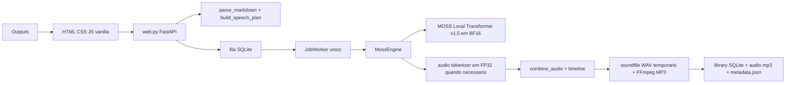
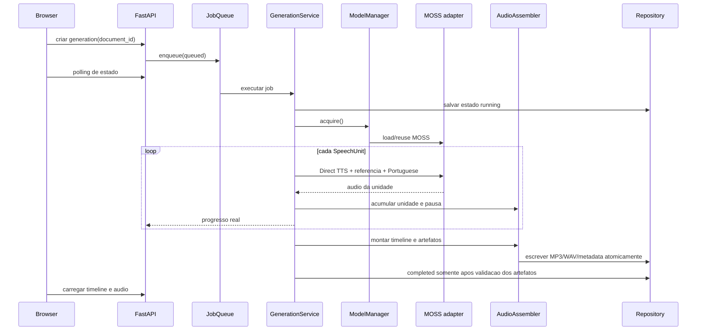

# Arquitetura do Markdown TTS

Este documento distingue o que existe hoje (`CURRENT`) do que e recomendado para a evolucao (`TARGET`). Componentes `TARGET` nao estao implementados.

## Objetivos e restricoes

O sistema e um leitor local de Markdown para estudo. A prioridade e, nesta ordem, correcao, qualidade vocal, confiabilidade, UX e velocidade. A plataforma principal e Windows com Python 3.12, RTX 3060 12 GB, 16 GB RAM e CUDA via PyTorch.

O pipeline deve continuar privado e local depois que modelos e dependencias estiverem disponiveis. A inferencia aprovada e `OpenMOSS-Team/MOSS-TTS-Local-Transformer-v1.5`, com `language="Portuguese"`, `voices/narrator_reference.wav` e Direct TTS independente por unidade. Continuation/context chaining e outros motores estao fora do desenho aprovado.

## CURRENT: componentes



`web.py` concentra rotas, validacao de entrada, threads, locks, estado de jobs e coordenacao. Os endpoints atuais sao `GET /`, `POST /api/plan`, `POST /api/generate`, `GET /api/jobs/{job_id}`, `GET /api/download/{job_id}` e `GET /audio/<arquivo>`.

`markdown_parser.py` usa `markdown-it-py` em CommonMark e produz `MarkdownBlock` para headings, paragraphs, lists, blockquotes e code. `speech_plan.py` produz `SpeechUnit` imutavel, divide paragrafos em frases, adiciona pausas, trata listas contextuais e valida preservacao de conteudo. `link_units` atribui `previous_id` e `next_id`; `section_id`, `paragraph_id` e `sentence_index` apoiam estrutura e navegacao.

`moss_engine.py` codifica a referencia com `soundfile`, move o tokenizer para CUDA, devolve os codigos para CPU, carrega o modelo em BF16 e gera cada unidade independentemente. Antes do decode, o runaway guard conta frames acusticos, rejeita duracoes claramente implausiveis e repete somente a unidade afetada com seed deterministica. Depois o engine decodifica, combina e exporta. `audio_io.py` gera `AudioTimelineEntry` com inicio/fim reais e pausa posterior. Novos MP3s, Markdown e manifests ficam em `library/`; SQLite indexa documentos, geracoes e timeline via metadata.

O frontend faz preview via `/api/plan`, inicia uma geracao, consulta o job por polling de 500 ms, carrega o MP3 e usa timestamps reais para highlight. Possui play/pause, seek bar, velocidade 0.75x-2x, clique na unidade e download.

## CURRENT: problemas e limites

- Jobs vivem somente em memoria e desaparecem no restart.
- Um worker unico usa claim FIFO atomico, heartbeat e recovery; nao ha paralelismo TTS.
- O modelo e carregado por geracao e liberado depois; nao existe ModelManager explicito.
- A biblioteca nao possui ainda reconciliation automatica para artefatos orfaos apos crash.
- WAV opcional e historico de regeneracao ainda nao existem.
- Cancelamento e cooperativo entre unidades; ASR, retry seletivo e regeneracao nao existem.
- O progresso e agregado em parsing, generation, decode e export.
- O player nao restaura posicao do servidor e nao tem anterior/proxima, +/-10 s ou atalhos.
- O preview atual e o Speech Plan, nao um renderer Markdown completo.
- Algumas siglas podem exigir tratamento pontual; nao ha dicionario fonetico.
- `environment-current.txt` e snapshot diagnostico, nao lock de dependencias.
- O `.gitignore` versionado contem texto literal de um bloco PowerShell, aparentando ser uma inconsistência operacional que deve ser corrigida separadamente e com cuidado.

## TARGET: limites recomendados

A evolucao deve usar poucas camadas com contratos claros:

```text
api/              FastAPI, DTOs, auth local inexistente, HTTP e eventos
jobs/             estados, fila, worker unico, cancelamento e recovery
services/         GenerationService e coordenacao de casos de uso
domain/           Document, SpeechUnit, Timeline, Generation, PlaybackState
speech/           MarkdownParser, SpeechPlanner, PronunciationOverrides
              
tts/              MossEngine adapter e ModelManager
 audio/           AudioAssembler, codecs, exportadores e atomicidade
persistence/      SQLite, blobs filesystem, metadata e migrations
validation/       AudioValidator, AsrEngine interface e normalizacao
static/           editor, preview, player, biblioteca e fila
```

Estas pastas sao uma proposta, nao uma ordem para mover arquivos imediatamente. A primeira migracao deve introduzir contratos e adaptadores sem alterar o caminho atual.

## TARGET: fluxo de geracao



O worker deve acessar a inferencia pesada exclusivamente por `ModelManager`. Chamadas HTTP, consultas da biblioteca e atualizacoes de playback podem ocorrer em paralelo, mas nao podem carregar um segundo MOSS nem gerar duas unidades pesadas simultaneamente.

## TARGET: dominio e modelos de dados

### Document

Representa o Markdown original e sua identidade: `document_id`, titulo derivado/editavel, `markdown`, `created_at`, `updated_at` e revisao/conteudo hash. O Markdown original deve ser imutavel dentro de uma `Generation`; uma edicao cria nova revisao ou nova geracao claramente relacionada.

### Generation

Representa uma tentativa de audio: `generation_id`, `document_id`, `status`, `created_at`, `completed_at`, configuracao, modelo/revisao, referencia vocal, duracao, paths relativos e resultado de validacao. Estados terminais devem distinguir `completed`, `failed`, `cancelled` e `interrupted`.

### SpeechUnit

Mantem `id`, `kind`, `display_text`, `synthesis_text`, `source_atoms`, pausas e IDs estruturais. `display_text` e o texto visual; `synthesis_text` pode receber override pontual futuro. O planner deve continuar validando preservacao e ordem dos `source_atoms`.

### TimelineEntry

Mantem `unit_id`, `start_seconds`, `end_seconds`, `pause_after_ms`, kind e texto visual. O contrato de frase continua sendo a unidade de highlight. Word-level spans sao uma extensao opcional, nunca requisito para reproduzir o audio.

### PlaybackState

`generation_id`, `position_seconds`, `active_unit_id`, `playback_rate`, `updated_at` e, se necessario, `client_revision`. Atualizacoes devem ser idempotentes e com debounce no frontend.

## TARGET: metadata e persistencia

A escolha recomendada e **SQLite + filesystem**:

- SQLite e a fonte de verdade do estado mutavel: guarda indice, documentos, geracoes, estados de jobs, playback, configuracoes resumidas e referencias a artefatos.
- Filesystem guarda `document.md`, `audio.mp3`, WAV opcional, `metadata.json` e eventualmente audio por unidade para regeneracao.
- `metadata.json` e um manifesto/snapshot versionado e portatil da geracao, nao a fonte autoritativa do estado durante runtime normal.
- SQLite e melhor que JSON como indice para filtros, ordenacao, concorrencia, estados e recovery.
- Em caso de divergencia durante runtime normal, SQLite prevalece. Reconciliation futura pode verificar ou reconstruir dados usando SQLite, manifests e filesystem conforme regras definidas.
- JSON continua util como manifesto portavel e auditavel por geracao; nao deve ser o mecanismo de consulta concorrente.

Estrutura conceitual:

```text
library/
  <document_id>/
    document.md
    <generation_id>/
      audio.mp3
      audio.wav                 # opcional
      metadata.json
      units/                    # opcional, se regeneracao granular for habilitada
        000001.wav
```

O `metadata.json` deve ter `schema_version` e incluir, no minimo:

```json
{
  "schema_version": 1,
  "document_id": "...",
  "generation_id": "...",
  "title": "...",
  "status": "completed",
  "created_at": "...",
  "updated_at": "...",
  "markdown_path": "document.md",
  "audio": {"mp3_path": "audio.mp3", "wav_path": null},
  "model": {"id": "...", "revision": "..."},
  "voice": {"reference_path": "voices/narrator_reference.wav", "sha256": "..."},
  "audio_format": {"sample_rate": 48000, "channels": 2, "mp3_bitrate": "192k"},
  "units": [],
  "timeline": [],
  "playback": {"position_seconds": 0, "active_unit_id": null, "speed": 1},
  "generation_config": {},
  "validation": null,
  "regeneration_history": []
}
```

O schema real deve ser definido na fase de persistencia. Campos sensiveis nao devem ir para logs. Migrations do SQLite devem ser numeradas, forward-only com backup antes da aplicacao e testadas com fixtures de cada versao. O manifesto JSON deve ter sua propria versao e ser escrito depois dos blobs, sem poder promover sozinho uma geracao a `completed`.

## TARGET: jobs, fila e cancelamento

A fila recomendada e FIFO persistida no SQLite, com prioridade como extensao explicita e um worker unico para TTS. `queued -> running -> cancelling -> cancelled` e complementado por `failed`, `interrupted` e `completed`.

Cancelamento e cooperativo: o frontend solicita cancelamento, o worker marca `cancelling`, verifica um token entre unidades e encerra antes da proxima inferencia. O worker deve limpar temporarios e publicar `cancelled` somente depois de confirmar que nenhum artefato final parcial esta apontado como concluido. Se o cancelamento chegar depois da ultima unidade, prevalece uma politica deterministica documentada, preferencialmente concluir se os artefatos atomicos ja foram publicados.

O estado deve ser thread-safe no processo e transacional no SQLite. Um lease/heartbeat evita que dois workers assumam o mesmo job. O servidor pode responder consultas enquanto o worker esta ocupado.

## TARGET: ModelManager e GPU

O manager controla `unloaded`, `loading`, `ready`, `generating`, `unloading` e `error`. Deve possuir lock de carga, referencia a uma unica instancia, timeout de ociosidade e metodo de shutdown. O caminho inicial mais conservador e manter a semantica atual: tokenizer codifica/decodifica em GPU quando necessario, modelo usa BF16, e memoria e liberada explicitamente onde o fluxo atual ja faz isso.

Em CUDA OOM, o job deve falhar de forma explicita, registrar diagnostico sem segredos, tentar liberar memoria de maneira controlada e deixar o manager recuperavel. Nao se deve alterar automaticamente dtype, modelo ou referencia como mecanismo de recovery.

Status de GPU e opcional. Se NVML ou metricas equivalentes nao estiverem disponiveis, a API deve retornar `unknown` e o frontend continuar funcional.

## TARGET: regeneracao individual

A unidade deve ser regenerada usando o mesmo `display_text`, `synthesis_text` efetivo, modelo, referencia canonica e idioma. O resultado deve ser escrito em temporario; depois o assembler recompila a sequencia inteira a partir das unidades, recalculando offsets da unidade alterada e de todas as posteriores. O MP3 final e metadata sao publicados por rename atomico somente quando completos.

A versao anterior deve permanecer ate a nova versao passar validacao estrutural e, se habilitada, ASR. O Markdown nao muda. Para listas contextuais, o ID representa a unidade de sintese inteira; regeneracao de subitem exige primeiro modelar subunidades, nao editar offsets manualmente.

## TARGET: ASR e validacao

`AudioValidator` deve depender de uma interface `AsrEngine`, nao de uma biblioteca concreta. O pipeline recomendado e:

`SpeechUnit esperado -> audio da unidade -> ASR local -> normalizacao -> score/diagnostico -> pass|warn|fail`.

Faster-Whisper e Whisper sao candidatos para benchmark, nao uma escolha nesta fase. O benchmark deve medir PT-BR, memoria, VRAM, latencia e qualidade. Preferir executar ASR apos liberar o MOSS da GPU ou em processo/ciclo controlado, pois a RTX 3060 tem 12 GB.

Normalizacao pode uniformizar case, acentos, espacos e pontuacao, mas deve preservar palavras relevantes, numeros, siglas e tokens tecnicos. Similaridade de caracteres isolada nao basta: combinar cobertura de tokens, alinhamento aproximado e regras para truncamento/audio vazio. Thresholds devem ser configuraveis, explicaveis e limitados para evitar loops de regeneracao.

## TARGET: polling e eventos

Manter polling como primeira evolucao: o frontend ja o usa, o ambiente e local e o protocolo e simples de depurar. Melhorar o payload para incluir fase, unidade, contadores, mensagem, ETA opcional e erro estruturado. Considerar SSE se muitos clientes ou polling frequente se tornar problema; WebSocket nao e necessario para eventos unidirecionais e adicionaria complexidade operacional.

## TARGET: frontend

Continuar com JavaScript vanilla enquanto o fluxo couber nele. Separar visualmente editor/preview, biblioteca, fila, reader e player sem obrigar uma build Node. O preview Markdown deve ser seguro e renderizar estrutura visual sem se tornar a fonte do texto de sintese. Cada elemento de leitura deve manter referencia ao `unit_id` e a timeline real.

O player deve persistir velocidade e posicao, oferecer anterior/proxima, +/-10 s, atalhos, foco acessivel, clique em unidade, scroll e fallback quando audio/timeline estiverem indisponiveis. Playback rate nunca deve reexportar o arquivo.

## TARGET: crash recovery e artefatos

Eventos relevantes:

- Navegador fecha: job continua no worker; ao reabrir, biblioteca consulta estado persistido.
- Servidor reinicia durante job: heartbeat expirado marca `interrupted`/`failed`; nunca `completed` sem manifestos e arquivos validos.
- FFmpeg falha: MP3 nao e publicado; WAV temporario e removido ou preservado em diagnostico controlado.
- CUDA OOM: job falha com motivo; manager libera recursos e nao tenta mudar metodologia silenciosamente.
- Windows reinicia: temp incompleto e lock antigo sao detectados por startup reconciliation.
- Arquivo parcial: usar diretório temporario, fsync quando apropriado, rename atomico e checksum/tamanho antes de registrar conclusao.

Uma rotina de reconciliation deve comparar SQLite e filesystem, marcar orfaos e oferecer limpeza segura. `narrator_reference.wav` fica fora de qualquer limpeza automatica.

## TARGET: retencao, integridade e voz

A politica deve ser configuravel: manter tudo, manter ultimos N documentos/geracoes, ou limpeza manual. Exclusao exige confirmacao e deve registrar o que foi removido. Temporarios e artefatos orfaos podem ser limpos por idade, com dry-run inicial.

Na inicializacao, validar existencia, formato basico e SHA-256 esperado da referencia quando configurado. O checksum e o identificador da referencia no metadata, nao um mecanismo para modificar o arquivo. Backups devem ser externos ao ciclo de limpeza e documentados.

## TARGET: dependencias e testes

`environment-current.txt` deve continuar sendo tratado como evidencia do ambiente atual. Uma futura estrategia de pinning deve separar dependencias diretas da aplicacao, wheel de PyTorch/CUDA, versoes de Transformers/Hugging Face Hub, `markdown-it-py`, FastAPI, Uvicorn e `soundfile`, alem da revisao dos remote-code files MOSS.

A matriz de testes deve ser:

| Classe | Requer GPU/modelo | Exemplos |
| --- | --- | --- |
| Unidade | Nao | parser, frases, planner, links, schema |
| Integracao leve | Nao | SQLite, repositorios, API, jobs com doubles |
| Browser | Nao necessariamente | player, timeline, teclado, preview seguro |
| Smoke TTS | Sim | uma unidade, codec, exportacao |
| Regressao de qualidade | Sim | corpus PT-BR, referencia canonica, comparacao auditiva/ASR |

A suite normal nunca deve baixar modelo. Mudancas no caminho MOSS devem exigir validacao de regressao em hardware de referencia.

## Estrategia de migracao

1. Caracterizar parser, Speech Plan, audio assembler e API sem mudar runtime.
2. Introduzir modelos e servicos por adaptadores, mantendo `web.py` funcionando.
3. Adicionar SQLite/filesystem com importacao ou modo leitura dos outputs legados.
4. Mover jobs para worker unico persistente e adicionar recovery.
5. Encapsular MOSS em ModelManager sem alterar Direct TTS, dtype ou referencia.
6. Persistir timeline/playback e evoluir o player.
7. Adicionar regeneracao somente quando unidades e artefatos forem atomicos.
8. Adicionar ASR opt-in por interface, apos benchmark de recursos.
9. Evoluir preview, retencao, progresso e UX.
10. Somente depois avaliar alinhamento por palavra e aplicativo desktop.

Cada passo deve ter commit pequeno, criterios de aceitacao, teste focado e rollback. O caminho atual permanece disponivel ate o novo caminho reproduzir o comportamento do baseline.
